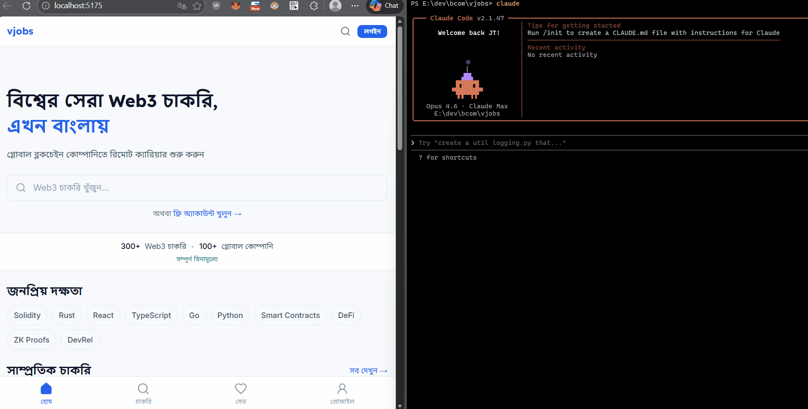
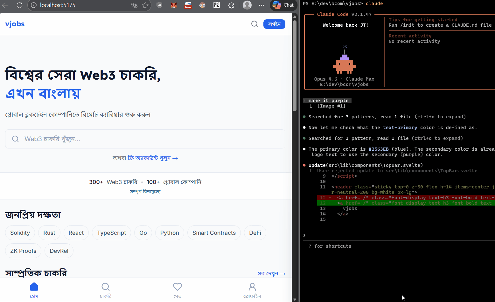

# Nano Snipper

A fast screenshot tool for Windows, built in Rust.


# Quickstart

1. Build the project
```bash
cargo build --workspace --release
```
2. Run `target\release\nanosnipper.exe` — appears in the system tray

3. Press `Ctrl+Shift+1` to capture a region, or `Ctrl+Shift+2` for fullscreen

4. Annotate your screenshot, then click the checkmark (or `Shift+Enter`) to save and copy


# Screenshot






## Features

- Instant capture (< 1 ms to clipboard at P50)
- Built-in annotation editor (arrows, rectangles, highlights, pen, blur, text, emoji)
- Right-click drag to reposition any annotation
- 9-color palette + 3 thickness presets
- Undo / redo (supports both draw and move operations)
- Automatic history with full-resolution PNGs and thumbnail previews
- Configurable hotkeys, retention policy, and start-on-login
- System tray integration
- Single daemon process, low memory footprint (~79 MB idle)

## Keyboard Shortcuts

### Capture

| Key | Action |
|-----|--------|
| Ctrl+Shift+1 | Region capture |
| Ctrl+Shift+2 | Fullscreen capture |

### Annotation Editor

| Key | Action |
|-----|--------|
| A | Arrow tool |
| R | Rectangle tool |
| H | Highlight tool |
| P | Pen tool |
| B | Blur tool |
| T | Text tool |
| E | Emoji tool |
| Right-click drag | Move annotation |
| Ctrl+Z | Undo |
| Ctrl+Y | Redo |
| Enter / Shift+Enter | Done (save + copy) |
| Escape | Cancel |


# What problem we solve

Windows Snipping Tool feels heavier than it should.

It often:

- takes over 500 ms just to get pixels on the clipboard

- adds another 2–3 seconds at P95

- provides no built-in annotation before copying

- launches a full UI process for every capture

Nano Snipper exists to do one thing well: **capture your screen and get it on the clipboard as fast as possible, with annotations if you want them.**

## Why it is faster

Nano Snipper keeps the stack simple and close to the system:

- Native Win32 daemon: no frameworks, no runtimes, no Electron — just a message loop and a tray icon

- GPU capture: DXGI Output Duplication grabs the frame directly from the display adapter

- Deferred clipboard: the clipboard is announced before the CPU ever touches pixel data

- Persistent resources: the overlay, annotation editor, D3D11 device, and DXGI duplication are all pre-created at startup and reused across captures

- Background saves: PNG encoding runs on a separate thread so it never blocks the next capture

Result: **less waiting, instant paste.**


# Benchmarks

Test machine: Windows 11, Intel UHD Graphics, release build.
Fullscreen capture, median of 10 runs.

Benchmark harness and raw data via `snip-bench.exe`.

## Hotkey to clipboard

| Metric | Nano Snipper | Windows Snipping Tool | Speedup |
|--------|-------------|----------------------|---------|
| P50 | **< 1 ms** | 513 ms | **> 500x** |
| P95 | **10 ms** | 2,652 ms | **~265x** |

## Paste render

| Metric | Nano Snipper | Windows Snipping Tool |
|--------|-------------|----------------------|
| P50 | **13.5 ms** | 24 ms |

## Memory

| Metric | Nano Snipper | Windows Snipping Tool |
|--------|-------------|----------------------|
| Idle | **79 MB** | — |
| Peak | **125 MB** | 180 MB |

## Startup

Total cold start: **~128 ms** (D3D11 device + overlay + editor + history DB, parallelized).


## Architecture

Three binaries, 13 crates.

```
nanosnipper.exe Daemon — Win32 message loop, DXGI capture, Direct2D overlay + editor, system tray
snipui.exe      Settings & history UI — iced 0.13 (tiny-skia CPU renderer)
snip-bench.exe  Benchmark harness — SendInput, clipboard polling, memory profiling
```

```
crates/
  ns-common/         Shared types — config, IPC protocol, history model, paths
  nanosnipper/       Daemon binary — message loop, state machine, tray
  snip-capture/      DXGI Output Duplication, D3D11 GPU crop, texture caching
  snip-overlay/      Fullscreen transparent overlay (Win32 + Direct2D)
  snip-clipboard/    CF_DIBV5 clipboard, delayed rendering
  snip-hotkeys/      RegisterHotKey wrapper
  snip-ui/           Annotation editor (Win32 + Direct2D)
  snip-history/      SQLite + PNG storage, JPEG thumbnails, background writer
  snip-ipc/          Named pipe server/client (length-prefixed JSON)
  snip-annotate/     Annotation data model + CPU renderer
  snip-ocr/          OCR placeholder
  snip-bench/        External benchmark harness
  snipui/            Settings & history GUI (iced)
```

## Installation

### Installer (recommended)

Download and run `NanoSnipperSetup.exe`. It installs to Program Files, creates Start Menu shortcuts, and optionally adds a desktop shortcut. Uninstall from Add/Remove Programs — your captures are preserved.

### Build from source

#### Prerequisites

- Rust (stable toolchain)
- MSVC Build Tools with Windows SDK
- Windows 11 (or Windows 10 1803+)
- [Inno Setup 6](https://jrsoftware.org/isinfo.php) (optional, for building the installer)

#### Build

```bash
# Debug
cargo build --workspace

# Release
cargo build --workspace --release
```

Release binaries land in `target/release/`.

#### Build installer

```powershell
powershell -ExecutionPolicy Bypass -File scripts\build-installer.ps1
```

Outputs `installer/Output/NanoSnipperSetup.exe`.

#### Run

```bash
# Start the daemon (sits in system tray)
target\release\nanosnipper.exe

# Open settings / history UI
target\release\snipui.exe
```

#### Running benchmarks

```bash
# Startup timing (standalone, exits after measuring)
nanosnipper.exe --benchmark-startup

# Nano Snipper fullscreen (requires nanosnipper running)
snip-bench.exe --tool nano-snipper --mode fullscreen --runs 10 --json

# Windows Snipping Tool comparison
snip-bench.exe --tool snipping-tool --mode fullscreen --runs 5 --delay 5
```

## Configuration

`%LOCALAPPDATA%\NanoSnipper\config.toml`

```toml
[hotkeys]
region = { modifiers = ["Ctrl", "Shift"], key = 49 }      # Ctrl+Shift+1
fullscreen = { modifiers = ["Ctrl", "Shift"], key = 50 }   # Ctrl+Shift+2

[behavior]
start_on_login = true

[retention]
max_age_days = 7
max_size_mb = 2048
```

## Data storage

```
%LOCALAPPDATA%\NanoSnipper\
  config.toml                           Settings
  history.db                            SQLite — metadata + JPEG thumbnails
  captures/
    screenshot_1739312400.png           Full-resolution capture
```

## Build Dependencies

| Crate | Version | Purpose |
|-------|---------|---------|
| windows | 0.62 | Win32 + WinRT bindings |
| iced | 0.13 | Settings/history GUI (tiny-skia software renderer) |
| tokio | 1 | Async runtime (IPC) |
| rusqlite | 0.32 | SQLite (bundled) |
| image | 0.25 | PNG encoding, thumbnails |
| tray-icon | 0.19 | System tray |
| serde + toml | 1 / 0.8 | Config serialization |
| tracing | 0.1 | Structured logging |
| uuid | 1 (v7) | Time-sortable history IDs |

## Security

The codebase has been through a security audit covering unsafe code, Win32 API usage, IPC, input validation, and error handling. Key hardening measures:

- IPC named pipe uses `FILE_FLAG_FIRST_PIPE_INSTANCE` to prevent pipe squatting
- All thread-shared state is protected by `Mutex` (no unsound `unsafe impl Send/Sync`)
- IPC messages are size-capped (10 MB) on both server and client
- File deletion is path-traversal-safe (canonicalization + prefix check)
- No shell metacharacter injection (`explorer.exe` instead of `cmd /C start`)
- All SQLite queries use parameterized statements
- No network code — local-only IPC
- App runs at standard user privilege (no elevation)

## License

MIT

Join the community: [t.me/GetVerse](https://t.me/GetVerse)

Made with <3 at Bitcoin.com
